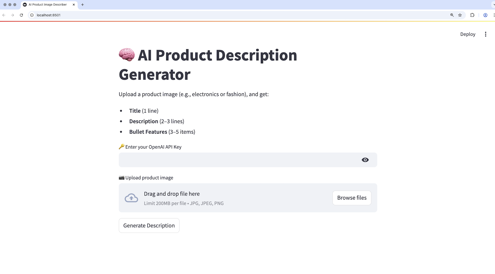
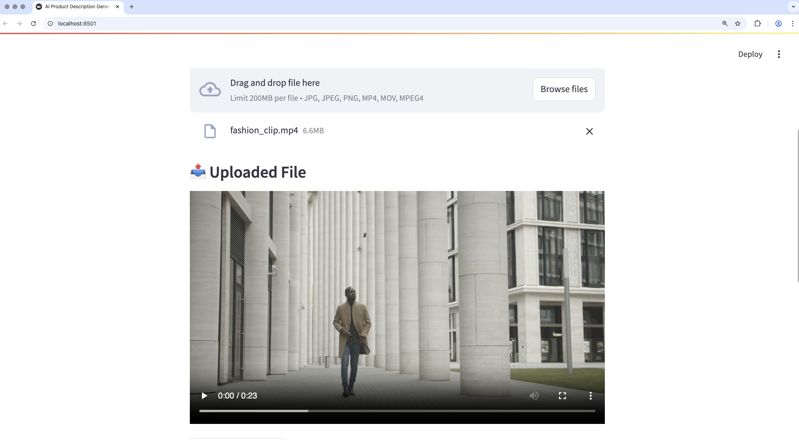
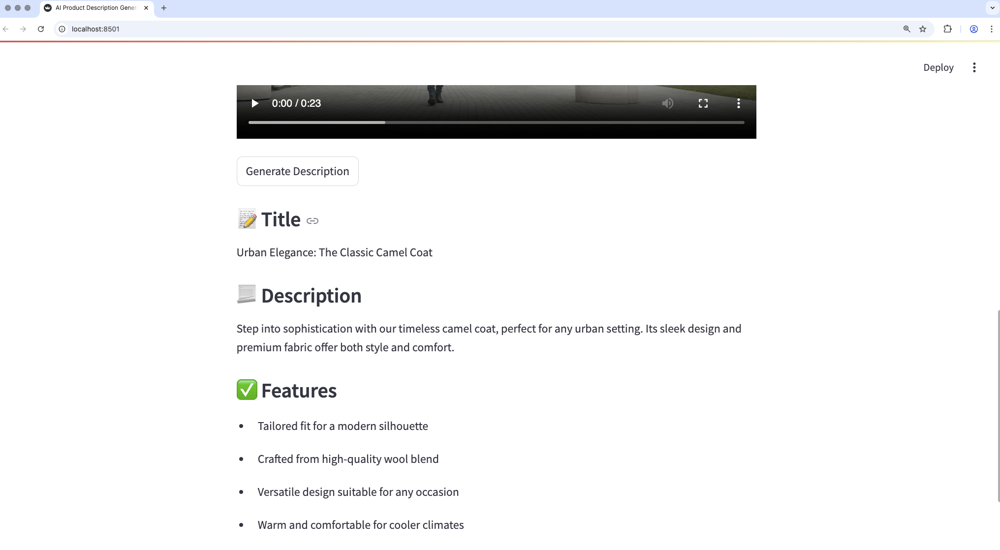

# AI Product Description Generator

This project uses GPT-4o via OpenAI's API to generate structured product descriptions (title, summary, features) from an image/video input. It includes a Streamlit interface for easy interaction.

---

## 🚀 Getting Started

Follow these steps to set up and run the project:

### 1️⃣ Create and Activate a Virtual Environment (Python 3.10)

#### macOS / Linux
```bash
python3.10 -m venv venv
source venv/bin/activate
```

#### Windows
```bash
python -m venv venv
venv\Scripts\activate
```

### 2️⃣ Install Dependencies
Install the project dependencies following command:
```bash
pip install .
```

### 3️⃣ Run the Streamlit App
To launch the application:
```bash
streamlit run app.py
```

Then open your browser and go to:

👉 http://localhost:8501/

You'll see homepage like below.



---

## ✅ INPUT
On the homepage, enter your OpenAI API key to enable GPT-4o’s multimodal capabilities.
Then, click the `Browse files` button to upload an image/video.
Once the file is uploaded, click `Generate Description` to view the results.


---
## ✨ Output
- Title: (1 line)
- Description: (2–3 lines)
- Features: 3–5 bullet points



---
## 📦 Project Structure
```
├── app.py                   # Main Streamlit interface
├── image_describer.py/      # Image processing / LLM logic
├── setup.py                 # Project setup script
├── requirements.txt         # List of dependencies
└── README.md                # You're here!
```

---

## 📄 License
This project is open-source and available under the [MIT License](LICENSE).
